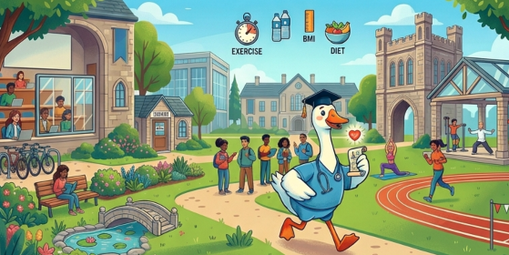

# Predicting Student Health Risk

Kaggle Playground Series S6E7 project for predicting student health risk:
https://www.kaggle.com/competitions/playground-series-s6e7

This repository uses a public-notebook-first Kaggle workflow. The notebooks
generate reproducible outputs, while `docs/` records the modeling rationale,
validation checks, leaderboard submissions, and next-step strategy.

## Current Result

| Model / Notebook | Public Score | Status |
| --- | ---: | --- |
| Balanced LGBM/XGB domain-feature ensemble, public notebook v8 | `0.94959` | Current champion |
| Class-balanced HGB baseline, public notebook v3 | `0.90603` | Former baseline |
| Unweighted HGB, public notebook v5 | `0.85038` | Rejected |

Current champion notebook:
https://www.kaggle.com/code/tuannm3812/student-health-risk-baseline-modeling

## What Worked

- **Domain-ordered categorical encoding** for stress, sleep quality, activity,
  diet, and smoking/alcohol.
- **Row-safe feature engineering** around sleep, activity, BMI, stress, and
  lifestyle signals.
- **Class-balanced tree models** to preserve `fit` and `unhealthy` sensitivity.
- **LightGBM/XGBoost probability blending** selected from OOF validation.
- **Notebook-generated submissions** for reproducibility and public review.

## Repository Structure

- `docs/`: competition notes, EDA findings, modeling decisions, submission
  manifest, and next-step strategy.
- `notebooks/`: executable Kaggle/local notebooks.
- `assets/`: README images (banner).
- `data/`: local competition files, intentionally ignored.
- `predictions/`: OOF/test prediction matrices, intentionally ignored.
- `scratch/`: temporary helper scripts and automation, intentionally ignored.

## Modeling Phase: Closed

`lgbm_xgb_domain_ensemble` (v8, public `0.94959`) is the **final champion**.
After v8 locked in, five further levers were tried and none cleared the
promotion gate (`>= 0.0002` OOF balanced-accuracy gain, no macro-F1 loss):

1. native pandas-categorical splits + 5-fold CV (v23 — largest positive
   gain found, `+0.000111`, but still short of the gate; macro F1 fell);
2. logistic-regression model-family diversity blended into the v8 ensemble
   (v22 — the blend-weight sweep itself chose 0% weight, the most decisive
   rejection);
3. rounding/precision artifact features on 5 numeric columns, after
   duplicate/near-duplicate row mining was checked and found empty for this
   dataset (v21 — smallest miss, essentially flat);
4. fold-safe target encoding of raw categoricals, incl. `gender` for the
   first time (v20 — bal-acc regressed slightly, macro F1 improved);
5. synthetic-geometry feature forge (v19 — regressed on both metrics).

Reading the source of several top-scoring public notebooks for this
competition (`kaggle kernels pull`) confirmed this is a documented ceiling,
not a gap in this project's modeling: every honest single/few-model public
approach found (XGBoost, RepLeafGBM, RealMLP, LightGBM) lands in the same
`0.9496`-`0.9499` band via the same underlying correction
(`class_weight='balanced'`, which v8 already uses). The visible public
leaderboard above `~0.951` is predominantly leaderboard-probing and
shared-submission-file voting rather than a better model — one top-scoring
notebook we reviewed documents itself explicitly as manual row edits
against someone else's shared submission file, not a standalone model.

See `docs/6_submission_manifest.md` and
`docs/9_leaderboard_improvement_insights.md` for the full experiment ledger,
the external-research writeup, and every rejected candidate's numbers.
